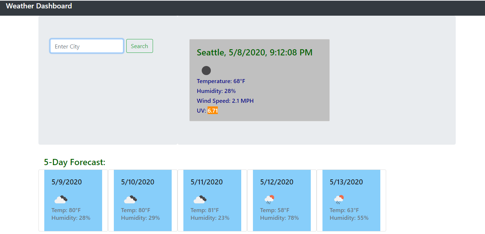

# Weather-Dashboard

## Description 

Weather-Dashboard is a weather application that that allows the user to search for the weather conditions of any city int he world.  This app will run in the browser and feature dynamically updated HTML and CSS powered by jQuery.  The app calls on three weather API's to pull data and display it for the user.  The information provided includes the city searched, the date, time, and an icon illustrating the current weather conditions.  The app also lists the temperature, humidity, wind speed, UV level, and a 5-day forecast.  The searches are stored in the browser and the data is retained upon refreshing the browser page.  The Weather-Dashboard utilizes HTML, CSS, JavaScript, jQuery, and OpenWeather API.  In the future, I will update this app to incorporate better styling and increase the number of data-fields that are displayed.

## Installation

Weather-Dashboard is hosted on github.  The installation requires that the user launch the application in their browser by clicking the following link:

https://josephbrimeyer.github.io/weather-dashboard/

## Photos

Here is a photo of the deployed application:

## Usage 

Upon loading the browser page, the user can enter a city to get the weather report and 5-day forcast.  Upon entering the city, the information is stored in local storage, and the daya can be retrieved by clicking on the prior city listed below the search bar.  If the user refreshes the page, the data persists and is retrieved from the browser.

## Credits
Open Weather: https://openweathermap.org/
EPA: https://www.epa.gov/sunsafety/uv-index-scale-0

## License

MIT License

Copyright (c) [2020] [Joseph Brimeyer]

Permission is hereby granted, free of charge, to any person obtaining a copy
of this software and associated documentation files (the "Software"), to deal
in the Software without restriction, including without limitation the rights
to use, copy, modify, merge, publish, distribute, sublicense, and/or sell
copies of the Software, and to permit persons to whom the Software is
furnished to do so, subject to the following conditions:

The above copyright notice and this permission notice shall be included in all
copies or substantial portions of the Software.

THE SOFTWARE IS PROVIDED "AS IS", WITHOUT WARRANTY OF ANY KIND, EXPRESS OR
IMPLIED, INCLUDING BUT NOT LIMITED TO THE WARRANTIES OF MERCHANTABILITY,
FITNESS FOR A PARTICULAR PURPOSE AND NONINFRINGEMENT. IN NO EVENT SHALL THE
AUTHORS OR COPYRIGHT HOLDERS BE LIABLE FOR ANY CLAIM, DAMAGES OR OTHER
LIABILITY, WHETHER IN AN ACTION OF CONTRACT, TORT OR OTHERWISE, ARISING FROM,
OUT OF OR IN CONNECTION WITH THE SOFTWARE OR THE USE OR OTHER DEALINGS IN THE
SOFTWARE.
## Contributing

[Contributor Covenant](https://www.contributor-covenant.org/)

